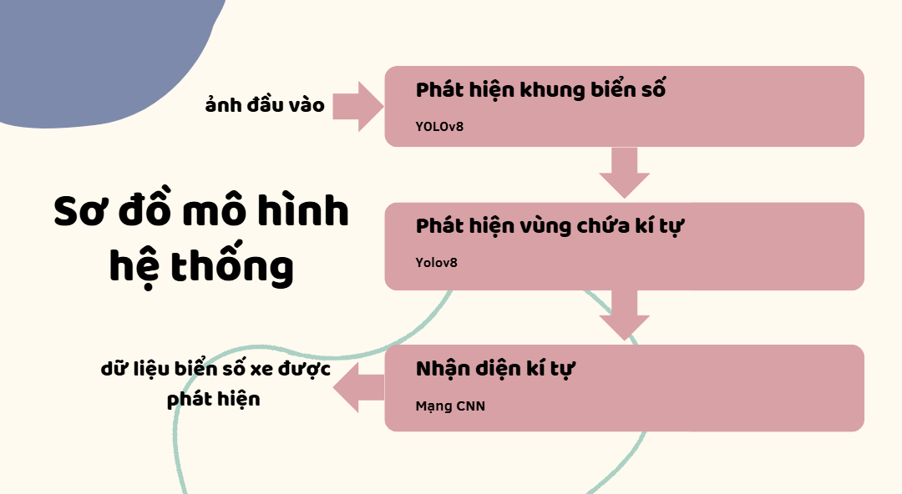
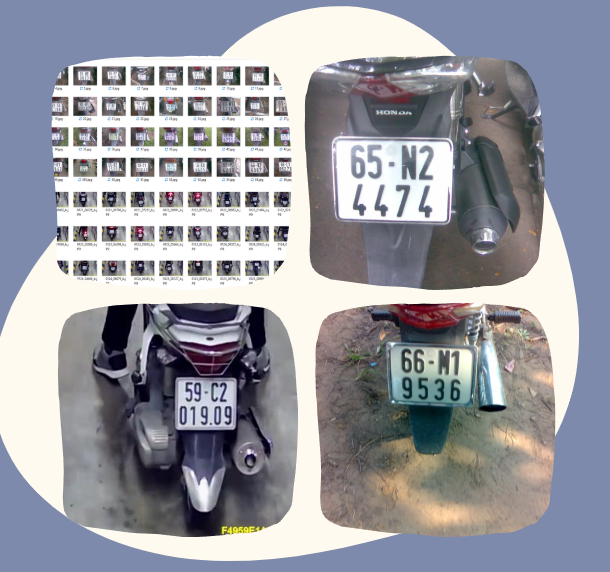
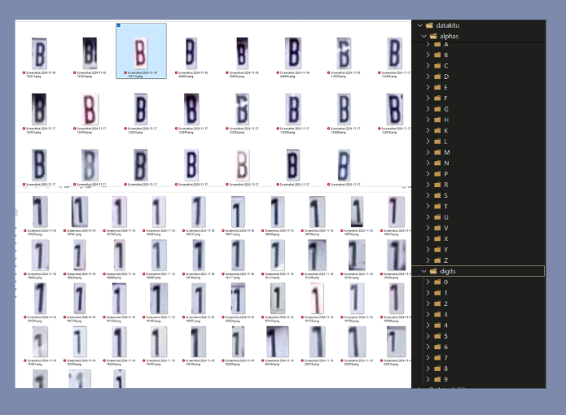
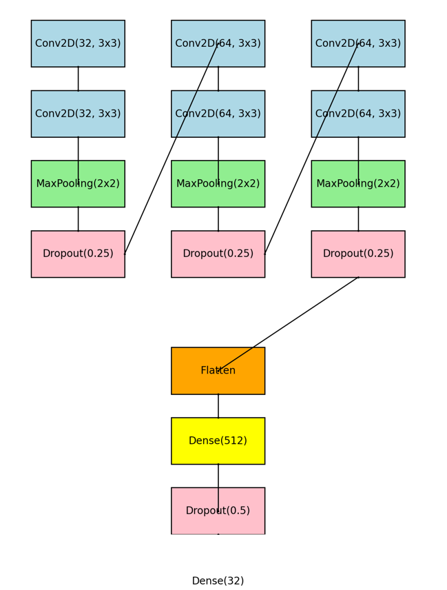

# LP_Recognition

## Giới thiệu
**LP_Recognition** là một dự án nhận diện biển số xe. Mục tiêu của dự án là phát hiện và nhận dạng biển số thông qua hai bước chính:
1. Phát hiện vùng biển số và các ký tự sử dụng YOLOv8.
2. Nhận diện ký tự trên biển số bằng mô hình CNN.

## Các thành phần chính

- **Phát hiện biển số xe**:
  - Sử dụng YOLOv8 để xác định vùng biển số và vị trí từng ký tự.
- **Nhận diện ký tự**:
  - Sử dụng CNN để phân loại các ký tự 0-9 và A-Z (ngoại trừ O, I, Q, W).

## Cách sử dụng
### Yêu cầu hệ thống
- Python 3.10.15
- Thư viện:
  - PyTorch
  - OpenCV
  - YOLOv8 (Ultralytics)
  - Matplotlib, Numpy

### Hướng dẫn chạy
1. Clone repository:
   ```bash
   git clone git@github.com:Phong74R5/LP_Recognition.git
   cd LP_Recognition
   ```
2. Cài đặt các thư viện:
   ```bash
   pip install -r requirements.txt
   ```
3. Chạy chương trình nhận diện biển số:
   ```bash
   python UI-AI.py
    ```
4. Ngoài ra còn có các module test cái chức năng tách biển, vị trí kí tự, phân loại kí tự
    ```bash
    python ./test/predict_tachbien.py 
    ```
    ```bash
    python ./test/predict_testkitu.py 
    ```
    ```bash
    python ./test/predict_testvitrikitu.py 
    ```
## Dataset
- Bộ dữ liệu bao gồm 463 bức ảnh chụp biển số xe, hình ảnh xe ra vào để huấn luyện YOLO.

- Các ký tự được xử lý và resize về kích thước 28x28 để huấn luyện CNN.


## Mô hình mạng CNN
